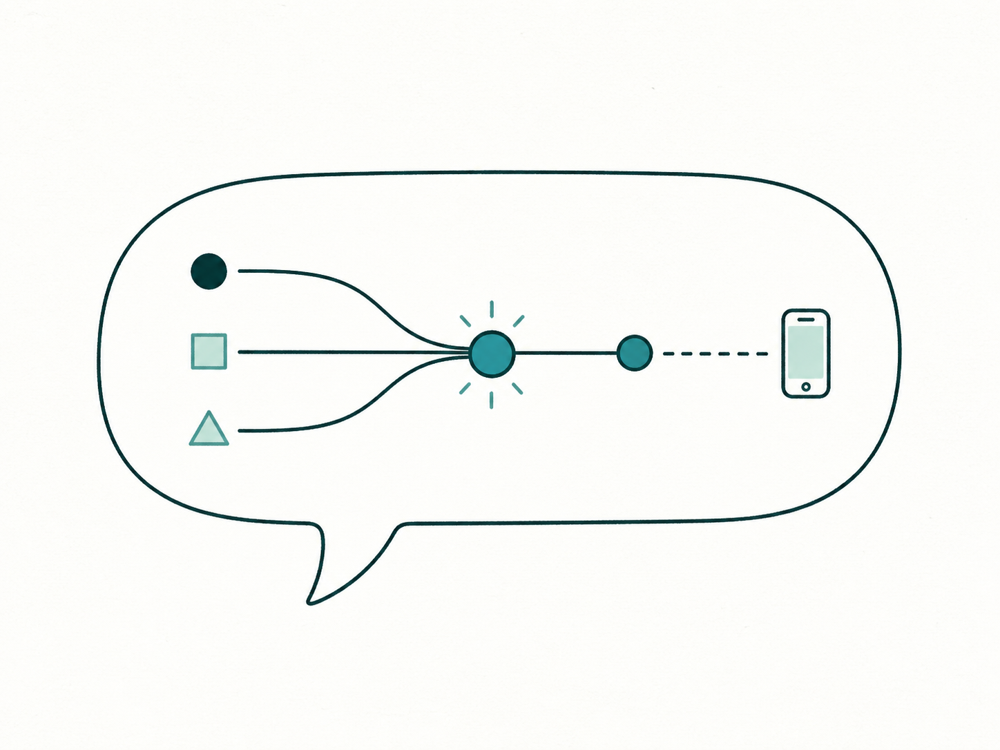
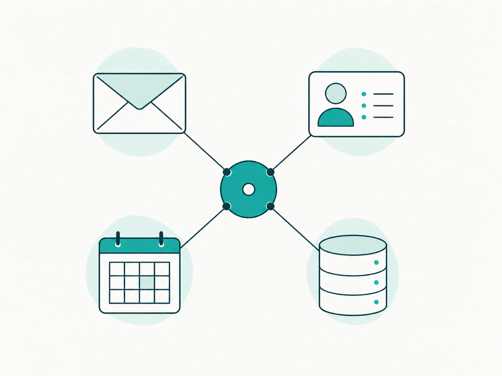
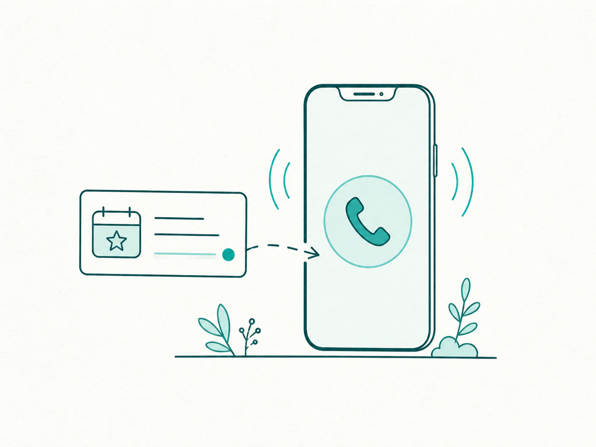

<p align="center">
  
</p>

<h1 align="center">Kordy</h1>

<p align="center">
  A no-code event agent that watches important signals, calls the right person with useful context, and helps them act without opening a dashboard.
</p>

<!-- README-HACK:NEEDS-OWNER key="demo-video" instruction="Add the final public demo video URL here before submission." -->
<p align="center">
  <a href="https://kordy-web-mif2krwk2q-uc.a.run.app">Open the live demo</a>
</p>

## Why Kordy

The alerts that matter most often arrive inside the same feeds as everything else: an urgent customer email, a failed production deployment, a payment problem, or a market threshold. Another notification does not solve that problem if nobody sees it in time.

Kordy turns a plain-language instruction into a persistent trigger. When the condition becomes real, it gathers only the relevant context and places a focused phone call. The phone becomes the escalation interface—not another inbox.

## What works today

- Describe a workflow in natural language, choose its source, and call yourself or a saved contact.
- Connect Gmail, Vercel, Notion, Google Calendar, GitHub, Stripe, or n8n; create triggers from built-in weather, SEC filing, earthquake, NASA EONET, foreign-exchange, and Indian end-of-day stock data.
- Combine exact sender, subject, body, label, project, event, timing, location, and threshold rules with a grounded semantic match.
- For Gmail, hear a concise summary, dictate a reply, and require explicit spoken approval before Kordy sends it.
- Choose automatic execution or approval-first delivery, with phone verification, consent, quiet hours, cooldowns, and per-user call limits.
- Review calls, evidence, outcomes, failures, and reply status from the application.

## From sentence to phone call

| 1. Describe the trigger | 2. Connect the context | 3. Receive the call |
| --- | --- | --- |
|  |  |  |

A representative flow is:

> When `xenonautrics@gmail.com` sends a priority escalation, call me, summarize it, ask what I want to reply, then send my approved response.

Gmail publishes the mailbox change, Kordy checks the compiled rules and intent, and CALL-E starts the conversation. If the recipient dictates a reply, Kordy sends nothing until the call result contains an explicit confirmation.

## Built for signal, not noise

Kordy applies cheap deterministic rules before semantic matching or call creation. Work is stored as idempotent source events and task runs, so duplicate provider notifications do not become duplicate calls. Provider polling is skipped when no active trigger needs it, and call reservations enforce a rolling daily budget.

The project includes a 64-scenario dry-run suite covering Gmail, Vercel, Notion, GitHub, Stripe, n8n, Calendar, weather, filings, earthquakes, natural events, FX, and Indian stocks. The suite reaches the real request-building boundary while intercepting transport so it cannot place a billable call. See the [automatic workflow test report](docs/automatic-workflow-test-report.md).

## Architecture

The Next.js application sends connection and workflow commands to a Hono API. PostgreSQL stores users, encrypted provider credentials, compiled triggers, source events, task runs, call reservations, and outcomes. A durable Bun worker consumes Gmail Pub/Sub events, signed webhooks, provider polling results, and public feeds; OpenAI models compile and ground the workflow; CALL-E places the call and returns structured results. Confirmed Gmail replies return through the same worker.

<!-- README-HACK:GRAPH
type: architecture
brief: Show a user operating the Next.js app; the Hono API writing encrypted connections, compiled triggers, source events, task runs, and call records to PostgreSQL; Gmail Pub/Sub, signed GitHub/Stripe/n8n webhooks, Vercel/Notion/Calendar pollers, and public-data feeds entering the Bun worker; OpenAI compiling and grounding matches; CALL-E placing a phone call; and an explicitly confirmed reply returning through the worker to Gmail. Mark the public HTTPS webhook boundary and the deterministic-filter-before-model boundary.
placement: after "Architecture"
-->

## Built with

- Bun workspaces and TypeScript
- Next.js 16, React 19, Tailwind CSS 4, and shadcn/ui
- Hono and Zod
- PostgreSQL 17 and Drizzle ORM
- OpenAI structured outputs for workflow compilation, matching, and call context
- CALL-E for outbound conversational calls
- Google OAuth, Gmail API, and Google Pub/Sub

## Run locally

Prerequisites: Bun, Docker, and the provider credentials for the integrations you want to exercise. On macOS this repository uses Colima as its Docker runtime.

```sh
bun install
cp apps/api/.env.example apps/api/.env
bun run db:up
bun run dev
```

Then open:

- Web app: `http://localhost:3006`
- API health: `http://localhost:3007/health`
- Demo login: `demo@gmail.com` / `demo1234`

For Gmail events and CALL-E callbacks, expose port `3007` through a persistent public HTTPS endpoint and configure the Google Pub/Sub push audience, Gmail callback, and `CALLE_WEBHOOK_URL` values documented in [`apps/api/.env.example`](apps/api/.env.example). Google OAuth must allow these local callback URLs:

- `http://localhost:3007/connections/gmail/callback`
- `http://localhost:3007/connections/google-calendar/callback`

Run the repository checks with:

```sh
bun run --cwd apps/api test
bun run lint
bun run typecheck
bun run build
```

## Prototype boundaries

- The included credentials are intentionally demo-only; production needs real account management and authorization.
- Live Gmail and CALL-E testing requires a stable public webhook endpoint. Temporary tunnels can expire or disconnect.
- Phone delivery, audio, and carrier detection depend on CALL-E and the recipient's carrier.
- SEC requests need an identifying user agent, and Indian stock triggers need a Twelve Data plan that permits the intended use.

## What's next

- Deploy the API and worker behind a permanent public endpoint.
- Replace demo authentication with production user and organization access controls.
- Add a real Slack connection and route team acknowledgements back into channels.
- Add the final architecture graphic, public demo video, and hosted demo link.
